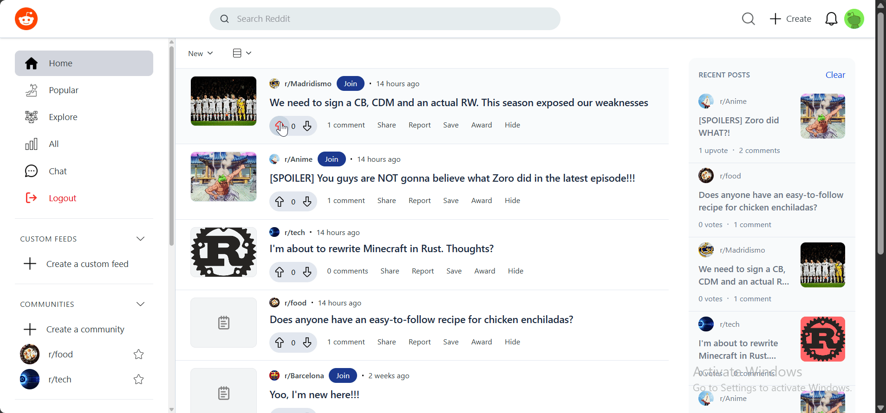
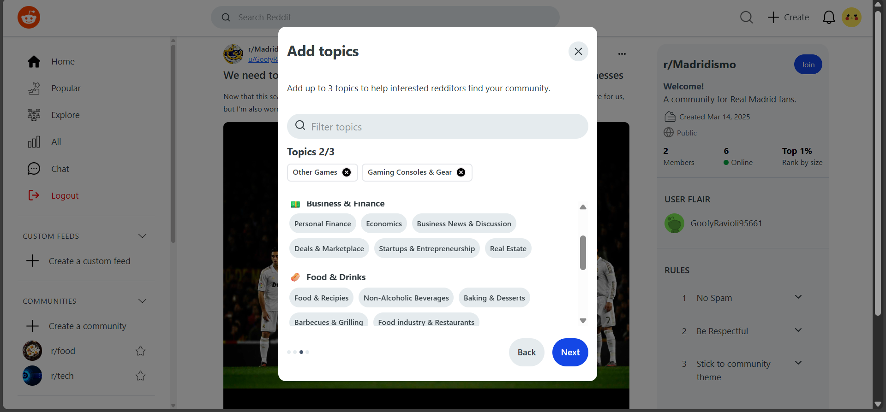
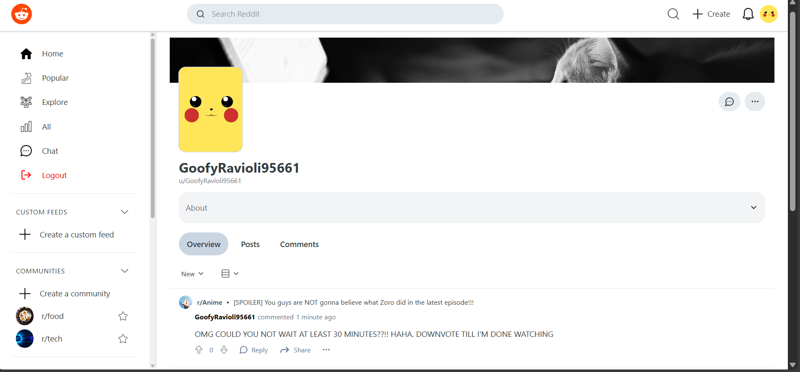

# Reddit Clone

## Project Overview
A full-stack Reddit clone built using React on the front-end and Django with DRF on the back-end. This project implements core features of Reddit, such as user auth, post + community creation, voting, comments, and community-based subreddits. Check it out [here](https://reddit-clone-seven-eta.vercel.app)!

## Features Demo
<div style="width:100%; display: flex; justify-content: space-between; margin-bottom: 10px">
    
    
</div>

<div style="width:100%; display: flex; justify-content: space-between; margin-bottom: 10px">
    
    
</div>

## Technologies Used
### Frontend
- React w/ Typescript
- React Router
- Vanilla + Tailwind CSS
- Fetch API
- TailwindCSS
- Vite
### Backend
- Django
- Django Rest Framework
- PostgreSQL
- JWT Authentication

## Installation and Setup
### Prerequisites
- Node.js (v14 or later)
- Python (v3.8 or later)
- PostgreSQL
### 1. Clone the Repository
```
git clone https://github.com/MickeyObas/reddit-clone.git
cd reddit-clone
```
### 2. Set up the Backend
1. Navigate to the `backend` directory
```
cd backend
```
2. Create a virtual environment
```
python -m venv venv
```
3. Install the dependencies
```
pip install -r requirements.txt
```
4. Apply migrations
```
python manage.py migrate
```
### 3. Set up the Frontend
1. Navigate to the `frontend` directory
```
cd frontend
```
2. Install the dependencies
```
npm install
```
### 4. Set up Environment Variables
In the `backend` directory, create a `.env` file based on `backend/.env.example`. Enter the appropriate values. 
```bash
cd backend
cp .env.example .env
```
In the `frontend` directory, create a `.env` file based on `frontend/.env.example`. Enter the appropriate values. 
```bash
cd frontend
cp .env.example .env
```
### 5. Usage
In the `backend` directory on the terminal:
```bash
python manage.py
```
In the `frontend` directory on the terminal:
```node
npm run dev
```
Navigate to `http://localhost:5173` (or whichever port the frontend is being served on) in your browser to interact with the app.


